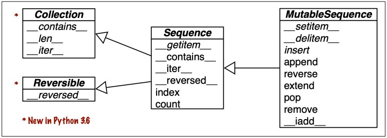
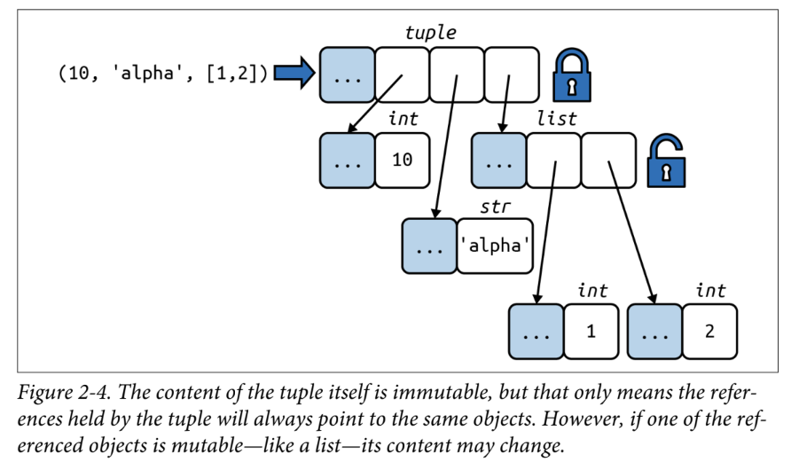

# Ch2. An Array of Sequences

## Different between sequence

- by storage type
    - container sequences: `list, tuple, collections.dequeue`
    - normal sequences: `str, bytes, bytesarray, memoryview, array.array`
    - The different between container sequence and normal sequence is based on the collection method
        - normal sequence just only collect one data type but container sequence can collection multiple data type in sequence
- by mutable
    - mutable sequences: `list, bytesarray, array.array, collections.dequeue, memoryview`
    - immutable sequences: `tuple, str, bytes`
    - 可以透過UML diagram的內涵function來判斷是否為mutable or immutable
        
        
        
        like this UML diagram

## List Comprehensions and Generator Expressions

The basic foundation of listcomps → just doing one things(create new list)

```python
# in for-loop
fruits = ["apple", "banana", "cherry", "kiwi", "mango"]
newlist = []

for x in fruits:
  if "a" in x:
    newlist.append(x)

# in listcomp
fruits = ["apple", "banana", "cherry", "kiwi", "mango"]
newlist = [x for x in fruits if "a" in x]

## the syntax
## The return value is a new list, leaving the old list unchanged
newlist = [expression for item in iterable if condition == True]
```

### Listcomp vs genexp

Genexp = Generator Expression

Genexp和Listcomp的差異是一個用圓括號一個用方括號，並且一個會回傳object with value demand，一個會回傳result as a list

所以在節省記憶體上，Genexp比較適合，不過在做計算上Listcomp更適合一點

```python
# List Comprehension
list_comprehension = [i for i in range(11) if i % 2 == 0]
print(list_comprehension )  # 0 2 4 6 8 10

# Generator Expression
generator_expression = (i for i in range(11) if i % 2 == 0)
print(generator_expression) # <generator object  at 0x000001452B1EEC50>
## could use loop to get value in Generator Expression
for i in generator_expression:
	print(i)                  # 0 2 4 6 8 10

```

## Tuple

1. underscore in python loop, `for country, _ in traveler_ids:` sometimes we would see that in python code, it means when using “underscore” → we don’t care about the value it give, so it better to using “_” than “i” if we wouldn’t use that variable anymore
    1. 
    
    ```python
    traveler_ids = [('USA', '31195855'), ('BRA', 'CE342567'), ('ESP', 'XDA205856')]
    
    for country, _ in traveler_ids:
    	print(country)  # USA, BRA, ESP
    ```
    
2. *args in tuple
    1. args: Non-Keyword Arguments
3. check [https://peps.python.org/pep-0448/](https://peps.python.org/pep-0448/) prod and cons
    1. [https://www.youtube.com/watch?v=8EZJL6E58Ao&ab_channel=麦兜搞IT](https://www.youtube.com/watch?v=8EZJL6E58Ao&ab_channel=%E9%BA%A6%E5%85%9C%E6%90%9EIT)

### Tuple as Immutable Lists

- Once a tuple is created, it cannot change its values. Tuples are **unchangeable**, or **immutable** as it also is called.
- but we can convert tuple into list type then change the value and convert back to tuple
    
    
    

```python
sample_tuple = (10, "string_type", [1, 2])
list_tuple = list(sample_tuple)
list_tuple[0] = 11
sample_tuple = tuple(list_tuple)
print(sample_tuple)    # (11, "string_type", [1, 2])
```

### Using * in tuple to grab or unpacking

- using * to grab value
    
    ```python
    # Using * to Grab Excess Items
    ## 1
    a, b, *rest = range(5)
    a, b, rest    # (0, 1, [2, 3, 4])
    
    ## 2
    a, *body, c, d = range(5)
    a, body, c, d # (0, [1, 2], 3, 4)
    ```
    
- using * to unpacking
    
    ```python
    # 1
    *range(4), 4 -> (0, 1, 2, 3, 4)
    # 2
    [*range(4), 4] -> [0, 1, 2, 3, 4]
    # 3
    {*range(4), 4, *(5, 6, 7)} -> {0, 1, 2, 3, 4, 5, 6, 7}
    ```
    
- my opinion
    - PEP-448 would allow us to pass dict with argument in some easy way, but it is hard to read
    
    ```python
    dict_one = {'x': 1, 'y': 2, 'z': 3}
    dict_two = {'a': 10, **dict_one}
    print(dict_two) # {'a': 10, 'x': 1, 'y': 2, 'z': 3}
    
    dict_two = {'a': 10, 'x': 20, **dict_one}
    print(dict_two) # {'a': 10, 'x': 1, 'y': 2, 'z': 3}
    
    dict_two = {**dict_one, 'a': 10, 'x': 20}
    print(dict_two) # {'x': 20, 'y': 2, 'z': 3, 'a': 10}
    ```
    

### Tuple in matching

- PEP 634: Structural Pattern Matching
    - reference
        - [https://peps.python.org/pep-0634/](https://peps.python.org/pep-0634/)

What is matching in Python?

- it using `mapping` to check the value is the same or not
- the type would be `dictionary` , using literal or varaible to map

```python
def parse(action):
    match action:
        case {'shift': s}:
            print(f'shift to state {s}')
        case {'reduce': r}:
            print(f'reduce using rule {r}')
        case {'goto': s}:
            print(f'go to state {s}')

parse({'reduce': 7})                # reduce using rule 7
parse({'goto': 3})                  # go to state 3
parse({'shift': 4, 'data': 'foo'})  # shift to state 4
```

- matching will check whether each key in the pattern exists in the target object, and other items in the target object would be ignored

If we want to get other key, value but not care about the key in the pattern, we can use ** to get whole remaining part in the dictionary

```python
def get_info(config):
    match config:
        case {'OS': 'Windows', **rest}:
            print(f'OS: Windows, other configs: {rest}')
        case {'OS': 'Linux', **rest}:
            print(f'OS: Linux, other configs: {rest}')
        case {'OS': 'macOS', **rest}:
            print(f'OS: macOS, other configs: {rest}')
        case {'OS': _, **rest}:
            print(f'OS: Unknown, other configs: {rest}')

get_info({'OS': 'Windows', 'version': '10'})
# OS: Windows, other configs: {'version': '10'}
get_info({'OS': 'Linux', 'dist': 'Ubuntu', 'version': '20.04'})
# OS: Linux, other configs: {'dist': 'Ubuntu', 'version': '20.04'}
get_info({'OS': 'WTF', 'what': 'spam'})
# OS: Unknown, other configs: {'what': 'spam'}
```

Something notices

1. using `**` to get other remain key, value in dictionary
2. using `literal` to get specific value
3. using wildcard `_` compare other value but not capture this value

Using data class in match

- the data class would let class implement has sequence

```python
@dataclass
class Point:
    x: int
    y: int

def where(point):
    match point:
        case Point(0, 0):
            print('Origin')
        case Point(x, 0):
            print(f'X axis with {x=}')
        case Point(0, y):
            print(f'Y axis with {y=}')
        case Point():
            print(f'Just a point')
        case _:
            print('Not a point')

where(Point(1, 0))  # X axis with x=1
where(Point(3, 4))  # Just a point
where('spam')       # Not a point
```

## Slicing

syntax: slice(start, end, step)

- start: Optional. An integer number specifying at which position to start the slicing. Default is 0
- end: An integer number specifying at which position to end the slicing
- step: Optional. An integer number specifying the step of the slicing. Default is 1

```python
# 1
a = ("a", "b", "c", "d", "e", "f", "g", "h")
x = slice(0, 8, 2)
print(a[x]) # ('a', 'c', 'e', 'g')

# 1
a = ("a", "b", "c", "d", "e", "f", "g", "h")
x = slice(0, 8, 3)
print(a[x]) # ('a', 'd', 'g')
```

### Assigning to Slices

```python
l = list(range(10))
print(l) # [0, 1, 2, 3, 4, 5, 6, 7, 8, 9]

l[2:5] = [20, 30]
print(l) # [0, 1, 20, 30, 5, 6, 7, 8, 9]

del l[5:7]
print(l) # [0, 1, 20, 30, 5, 8, 9]

l[3::2] = [11, 22]
# start at 3
# end to the end
# with 2 step
print(l) # [0, 1, 20, 11, 5, 22, 9]

l[2:5] = [100] -> should assign with list
print(l) # [0, 1, 100, 22, 9]
```

## Queue vs Dequeue

### Queue

The queue data structure also means the same where the data elements are arranged in a queue. The uniqueness of the queue lies in the way items are added and removed. Queues are open from both ends meaning elements are added from the back and removed from the front. So it is a First-in-First-out method. A queue can be implemented using a python list where we can use the insert() and pop() methods to add and remove elements. There is no insertion as data elements are always added at the end of the queueThe queue operations are given below.

- **Queue()** creates a new queue that is empty. It needs no parameters and returns an empty queue.
- **enqueue(item)** adds a new item to the rear of the queue. It needs the item and returns nothing.
- **dequeue()** removes the front item from the queue. It needs no parameters and returns the item. The queue is modified.
- **isEmpty()** tests to see whether the queue is empty. It needs no parameters and returns a boolean value.
- **size()** returns the number of items in the queue. It needs no parameters and returns an integer.

### Dequeue

A deque, also known as a double-ended queue, is an ordered collection of items similar to the queue. It has two ends, a front, and rear, and the items remain positioned in the collection. What makes a deque different is the unrestrictive nature of adding and removing items. New items can be added at either the front or the rear. Likewise, existing items can be removed from either end. In a sense, this hybrid linear structure provides all the capabilities of stacks and queues in a single data structure.

The deque operations are given below.

- **Deque()** creates a new deque that is empty. It needs no parameters and returns an empty deque.
- **addFront(item)** adds a new item to the front of the deque. It needs the item and returns nothing.
- **addRear(item)** adds a new item to the rear of the deque. It needs the item and returns nothing.
- **removeFront()** removes the front item from the deque. It needs no parameters and returns the item. The deque is modified.
- **removeRear()** removes the rear item from the deque. It needs no parameters and returns the item. The deque is modified.
- **isEmpty()** tests to see whether the deque is empty. It needs no parameters and returns a boolean value.
- **size()** returns the number of items in the deque. It needs no parameters and returns an integer.
